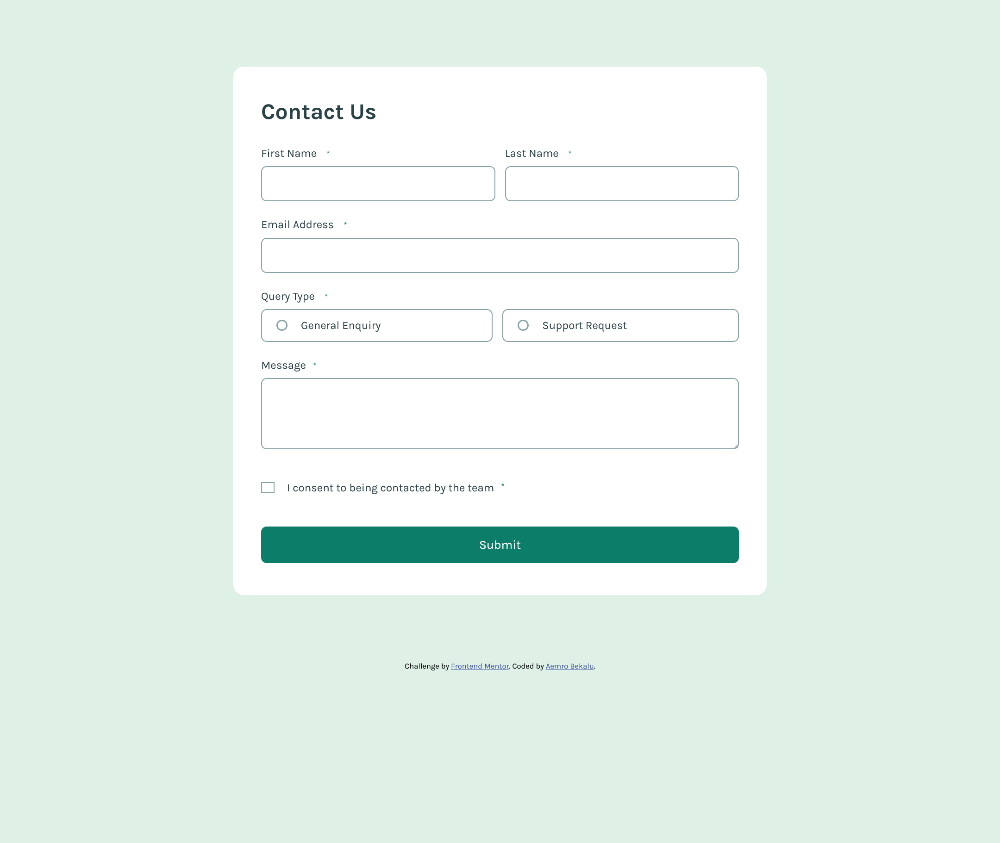
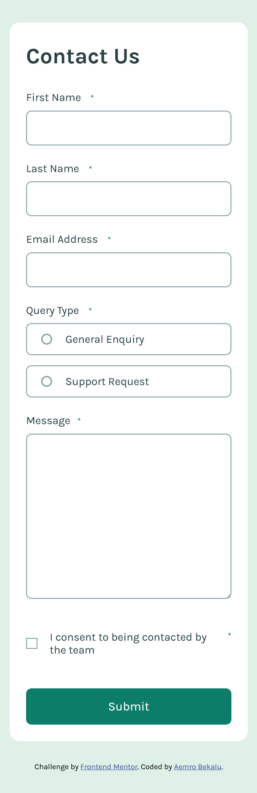

# Frontend Mentor - Contact form solution

This is a solution to the [Contact form challenge on Frontend Mentor](https://www.frontendmentor.io/challenges/contact-form--G-hYlqKJj). Frontend Mentor challenges help you improve your coding skills by building realistic projects.

## Table of contents

- [Overview](#overview)
  - [The challenge](#the-challenge)
  - [Screenshot](#screenshot)
  - [Links](#links)
- [My process](#my-process)
  - [Built with](#built-with)
  - [What I learned](#what-i-learned)
  - [Continued development](#continued-development)
  - [Useful resources](#useful-resources)
- [Author](#author)

## Overview

### The challenge

Users should be able to:

- Complete the form and see a success toast message upon successful submission
- Receive form validation messages if:
  - A required field has been missed
  - The email address is not formatted correctly
- Complete the form only using their keyboard
- Have inputs, error messages, and the success message announced on their screen reader
- View the optimal layout for the interface depending on their device's screen size
- See hover and focus states for all interactive elements on the page

### Screenshot

### Links

- Solution URL: [Add solution URL here](https://your-solution-url.com)
- Live Site URL: [live site URL](https://aemrobe.github.io/contact-form-mainn/)

## My process

### Built with

- Semantic HTML5 markup
- CSS custom properties
- Flexbox
- CSS Grid
- Mobile-first workflow
- [React](https://reactjs.org/) - JS library
- module css

### What I learned

In this challenge, I have learned how i can work with module css which is feature that some developers can use to write css classes for a specific component without worrying about that these classes might be used by the other developer who he/she is working with because the css class which that person writes inside that module will be unique evenif the other developer use the same classname inside other module. this is possible because of css module. it makes every className to be unique which is written inside that css module.

The other thing which i have learned from this challenges is how i can work with form validation with react. I have worked with form validation in js but this time in react it has some differences. It involves using states to control the inputs and use these value to implement the form validation and i felt a little bit easier when i work with react than js because i was able to use states to control the input values of the form.

### Continued development

In the future, i will continue to work with react and also include tailwindcss in my projects.

### Useful resources

- [Fix missing images from a deployed url](https://www.youtube.com/watch?v=uStf2HMXcAs&pp=0gcJCYQJAYcqIYzv) - This helped me to fix the issue which i had with the image that isn't displayed on deployed url of the project.

## Author

- Frontend Mentor - [@aemrobe](https://www.frontendmentor.io/profile/aemrobe)
- Twitter - [@Aemro112](https://www.twitter.com/Aemro112)
